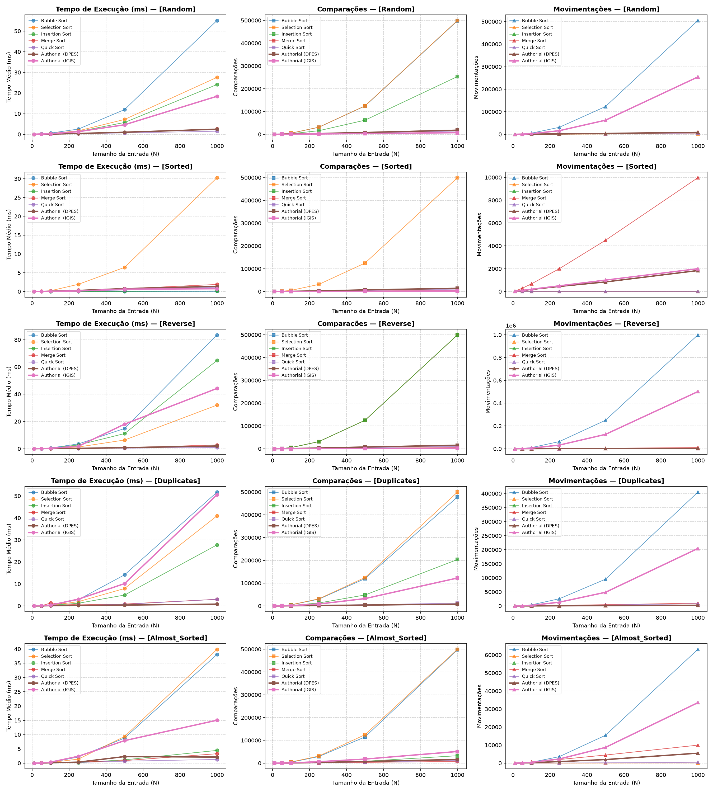
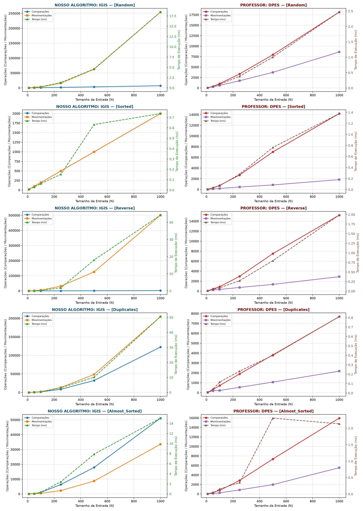
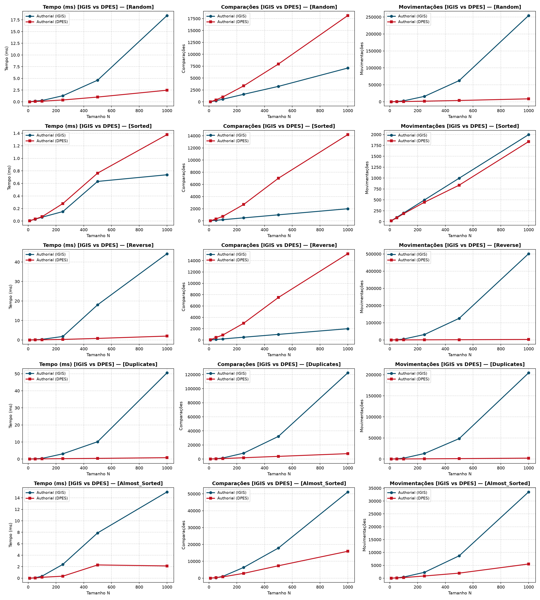

# Relatório Experimental de Benchmarks — APA (TP1)

> Gerado automaticamente por `python/benchmark.py` — seed 42, 3 repetições por tamanho.

## Gráficos Comparativos

### Visão Geral — Todos os Algoritmos

### IGIS (Aluno) vs DPES (Professor) — Lado a Lado por Distribuição

### Confronto Direto IGIS × DPES — Métrica por Métrica

---

## Distribuição: `RANDOM`

### 1. Tempo Médio de Execução (ms)

| Algoritmo | N=10 | N=50 | N=100 | N=250 | N=500 | N=1000 |
| :--- | :---: | :---: | :---: | :---: | :---: | :---: |
| Bubble Sort | 0.006 ms | 0.101 ms | 0.389 ms | 2.395 ms | 10.267 ms | 50.919 ms |
| Selection Sort | 0.004 ms | 0.059 ms | 0.209 ms | 1.274 ms | 6.160 ms | 26.580 ms |
| Insertion Sort | 0.004 ms | 0.051 ms | 0.232 ms | 1.215 ms | 5.369 ms | 23.963 ms |
| Merge Sort | 0.012 ms | 0.064 ms | 0.145 ms | 0.433 ms | 1.005 ms | 2.080 ms |
| Quick Sort | 0.011 ms | 0.044 ms | 0.109 ms | 0.289 ms | 0.810 ms | 1.524 ms |
| Authorial (DPES) | 0.007 ms | 0.055 ms | 0.118 ms | 0.354 ms | 0.893 ms | 2.062 ms |
| Authorial (IGIS) | 0.012 ms | 0.104 ms | 0.325 ms | 1.180 ms | 4.489 ms | 18.443 ms |

### 2. Número Médio de Comparações de Chaves

| Algoritmo | N=10 | N=50 | N=100 | N=250 | N=500 | N=1000 |
| :--- | :---: | :---: | :---: | :---: | :---: | :---: |
| Bubble Sort | 43 | 1.203 | 4.819 | 30.835 | 124.218 | 498.151 |
| Selection Sort | 45 | 1.225 | 4.950 | 31.125 | 124.750 | 499.500 |
| Insertion Sort | 31 | 635 | 2.630 | 15.678 | 61.964 | 253.446 |
| Merge Sort | 22 | 224 | 542 | 1.679 | 3.863 | 8.699 |
| Quick Sort | 55 | 435 | 986 | 2.892 | 6.338 | 14.036 |
| Authorial (DPES) | 31 | 415 | 1.037 | 3.364 | 7.953 | 18.147 |
| Authorial (IGIS) | 31 | 247 | 566 | 1.596 | 3.257 | 7.113 |

### 3. Número Médio de Movimentações de Elementos

| Algoritmo | N=10 | N=50 | N=100 | N=250 | N=500 | N=1000 |
| :--- | :---: | :---: | :---: | :---: | :---: | :---: |
| Bubble Sort | 49 | 1.174 | 5.073 | 30.867 | 122.941 | 504.905 |
| Selection Sort | 14 | 93 | 191 | 491 | 985 | 1.984 |
| Insertion Sort | 43 | 685 | 2.734 | 15.932 | 62.468 | 254.451 |
| Merge Sort | 34 | 286 | 672 | 1.994 | 4.488 | 9.976 |
| Quick Sort | 23 | 147 | 369 | 1.097 | 2.411 | 5.231 |
| Authorial (DPES) | 43 | 284 | 629 | 1.731 | 3.742 | 8.606 |
| Authorial (IGIS) | 43 | 685 | 2.734 | 15.932 | 62.468 | 254.451 |

---

## Distribuição: `SORTED`

### 1. Tempo Médio de Execução (ms)

| Algoritmo | N=10 | N=50 | N=100 | N=250 | N=500 | N=1000 |
| :--- | :---: | :---: | :---: | :---: | :---: | :---: |
| Bubble Sort | 0.004 ms | 0.004 ms | 0.004 ms | 0.009 ms | 0.024 ms | 0.052 ms |
| Selection Sort | 0.003 ms | 0.094 ms | 0.243 ms | 1.124 ms | 5.146 ms | 23.185 ms |
| Insertion Sort | 0.001 ms | 0.005 ms | 0.009 ms | 0.022 ms | 0.052 ms | 0.178 ms |
| Merge Sort | 0.010 ms | 0.072 ms | 0.119 ms | 0.336 ms | 0.731 ms | 1.714 ms |
| Quick Sort | 0.006 ms | 0.029 ms | 0.061 ms | 0.157 ms | 0.363 ms | 0.909 ms |
| Authorial (DPES) | 0.004 ms | 0.033 ms | 0.070 ms | 0.241 ms | 0.669 ms | 1.296 ms |
| Authorial (IGIS) | 0.021 ms | 0.030 ms | 0.059 ms | 0.189 ms | 0.326 ms | 0.687 ms |

### 2. Número Médio de Comparações de Chaves

| Algoritmo | N=10 | N=50 | N=100 | N=250 | N=500 | N=1000 |
| :--- | :---: | :---: | :---: | :---: | :---: | :---: |
| Bubble Sort | 9 | 49 | 99 | 249 | 499 | 999 |
| Selection Sort | 45 | 1.225 | 4.950 | 31.125 | 124.750 | 499.500 |
| Insertion Sort | 9 | 49 | 99 | 249 | 499 | 999 |
| Merge Sort | 15 | 133 | 316 | 983 | 2.216 | 4.932 |
| Quick Sort | 49 | 348 | 795 | 2.138 | 4.773 | 10.542 |
| Authorial (DPES) | 9 | 315 | 751 | 2.701 | 7.013 | 14.191 |
| Authorial (IGIS) | 18 | 98 | 198 | 498 | 998 | 1.998 |

### 3. Número Médio de Movimentações de Elementos

| Algoritmo | N=10 | N=50 | N=100 | N=250 | N=500 | N=1000 |
| :--- | :---: | :---: | :---: | :---: | :---: | :---: |
| Bubble Sort | 0 | 0 | 0 | 0 | 0 | 0 |
| Selection Sort | 0 | 0 | 0 | 0 | 0 | 0 |
| Insertion Sort | 18 | 98 | 198 | 498 | 998 | 1.998 |
| Merge Sort | 34 | 286 | 672 | 1.994 | 4.488 | 9.976 |
| Quick Sort | 0 | 0 | 0 | 0 | 0 | 0 |
| Authorial (DPES) | 18 | 86 | 182 | 446 | 838 | 1.838 |
| Authorial (IGIS) | 18 | 98 | 198 | 498 | 998 | 1.998 |

---

## Distribuição: `REVERSE`

### 1. Tempo Médio de Execução (ms)

| Algoritmo | N=10 | N=50 | N=100 | N=250 | N=500 | N=1000 |
| :--- | :---: | :---: | :---: | :---: | :---: | :---: |
| Bubble Sort | 0.007 ms | 0.142 ms | 0.612 ms | 3.519 ms | 14.269 ms | 65.485 ms |
| Selection Sort | 0.003 ms | 0.051 ms | 0.193 ms | 1.227 ms | 5.535 ms | 36.028 ms |
| Insertion Sort | 0.004 ms | 0.109 ms | 0.402 ms | 2.350 ms | 10.968 ms | 80.293 ms |
| Merge Sort | 0.010 ms | 0.108 ms | 0.155 ms | 0.370 ms | 0.842 ms | 4.193 ms |
| Quick Sort | 0.007 ms | 0.074 ms | 0.067 ms | 0.180 ms | 0.394 ms | 2.444 ms |
| Authorial (DPES) | 0.008 ms | 0.109 ms | 0.938 ms | 0.338 ms | 0.697 ms | 6.316 ms |
| Authorial (IGIS) | 0.009 ms | 0.161 ms | 0.342 ms | 2.121 ms | 7.200 ms | 81.894 ms |

### 2. Número Médio de Comparações de Chaves

| Algoritmo | N=10 | N=50 | N=100 | N=250 | N=500 | N=1000 |
| :--- | :---: | :---: | :---: | :---: | :---: | :---: |
| Bubble Sort | 45 | 1.225 | 4.950 | 31.125 | 124.750 | 499.500 |
| Selection Sort | 45 | 1.225 | 4.950 | 31.125 | 124.750 | 499.500 |
| Insertion Sort | 45 | 1.225 | 4.950 | 31.125 | 124.750 | 499.500 |
| Merge Sort | 19 | 153 | 356 | 1.011 | 2.272 | 5.044 |
| Quick Sort | 55 | 351 | 799 | 2.143 | 4.779 | 10.549 |
| Authorial (DPES) | 45 | 450 | 886 | 2.965 | 7.501 | 15.218 |
| Authorial (IGIS) | 18 | 98 | 198 | 498 | 998 | 1.998 |

### 3. Número Médio de Movimentações de Elementos

| Algoritmo | N=10 | N=50 | N=100 | N=250 | N=500 | N=1000 |
| :--- | :---: | :---: | :---: | :---: | :---: | :---: |
| Bubble Sort | 90 | 2.450 | 9.900 | 62.250 | 249.500 | 999.000 |
| Selection Sort | 10 | 50 | 100 | 250 | 500 | 1.000 |
| Insertion Sort | 63 | 1.323 | 5.148 | 31.623 | 125.748 | 501.498 |
| Merge Sort | 34 | 286 | 672 | 1.994 | 4.488 | 9.976 |
| Quick Sort | 14 | 54 | 104 | 254 | 504 | 1.004 |
| Authorial (DPES) | 63 | 240 | 336 | 731 | 1.347 | 2.892 |
| Authorial (IGIS) | 63 | 1.323 | 5.148 | 31.623 | 125.748 | 501.498 |

---

## Distribuição: `DUPLICATES`

### 1. Tempo Médio de Execução (ms)

| Algoritmo | N=10 | N=50 | N=100 | N=250 | N=500 | N=1000 |
| :--- | :---: | :---: | :---: | :---: | :---: | :---: |
| Bubble Sort | 0.008 ms | 0.164 ms | 0.780 ms | 4.711 ms | 15.528 ms | 90.665 ms |
| Selection Sort | 0.009 ms | 0.065 ms | 0.260 ms | 2.069 ms | 9.728 ms | 43.716 ms |
| Insertion Sort | 0.004 ms | 0.043 ms | 0.182 ms | 1.445 ms | 6.854 ms | 108.578 ms |
| Merge Sort | 0.030 ms | 0.061 ms | 0.308 ms | 0.395 ms | 1.669 ms | 10.711 ms |
| Quick Sort | 0.024 ms | 0.045 ms | 0.171 ms | 0.327 ms | 1.054 ms | 2.501 ms |
| Authorial (DPES) | 0.010 ms | 0.063 ms | 0.130 ms | 0.164 ms | 0.405 ms | 1.159 ms |
| Authorial (IGIS) | 0.018 ms | 0.250 ms | 0.882 ms | 4.033 ms | 20.683 ms | 84.639 ms |

### 2. Número Médio de Comparações de Chaves

| Algoritmo | N=10 | N=50 | N=100 | N=250 | N=500 | N=1000 |
| :--- | :---: | :---: | :---: | :---: | :---: | :---: |
| Bubble Sort | 40 | 1.139 | 4.626 | 29.682 | 119.698 | 478.167 |
| Selection Sort | 45 | 1.225 | 4.950 | 31.125 | 124.750 | 499.500 |
| Insertion Sort | 25 | 568 | 2.014 | 12.945 | 48.032 | 203.588 |
| Merge Sort | 21 | 213 | 506 | 1.586 | 3.647 | 8.214 |
| Quick Sort | 48 | 413 | 884 | 2.548 | 5.588 | 12.227 |
| Authorial (DPES) | 25 | 321 | 720 | 1.893 | 3.815 | 7.687 |
| Authorial (IGIS) | 31 | 481 | 1.520 | 8.404 | 32.193 | 122.521 |

### 3. Número Médio de Movimentações de Elementos

| Algoritmo | N=10 | N=50 | N=100 | N=250 | N=500 | N=1000 |
| :--- | :---: | :---: | :---: | :---: | :---: | :---: |
| Bubble Sort | 35 | 1.041 | 3.834 | 25.395 | 95.066 | 405.180 |
| Selection Sort | 12 | 75 | 153 | 391 | 811 | 1.627 |
| Insertion Sort | 35 | 619 | 2.115 | 13.195 | 48.531 | 204.588 |
| Merge Sort | 34 | 286 | 672 | 1.994 | 4.488 | 9.976 |
| Quick Sort | 21 | 203 | 461 | 1.420 | 3.361 | 7.753 |
| Authorial (DPES) | 35 | 192 | 225 | 541 | 1.069 | 2.174 |
| Authorial (IGIS) | 35 | 619 | 2.115 | 13.195 | 48.531 | 204.588 |

---

## Distribuição: `ALMOST_SORTED`

### 1. Tempo Médio de Execução (ms)

| Algoritmo | N=10 | N=50 | N=100 | N=250 | N=500 | N=1000 |
| :--- | :---: | :---: | :---: | :---: | :---: | :---: |
| Bubble Sort | 0.005 ms | 0.053 ms | 0.476 ms | 2.990 ms | 14.225 ms | 35.892 ms |
| Selection Sort | 0.006 ms | 0.107 ms | 0.430 ms | 2.172 ms | 9.014 ms | 31.724 ms |
| Insertion Sort | 0.003 ms | 0.015 ms | 0.040 ms | 0.299 ms | 1.519 ms | 3.717 ms |
| Merge Sort | 0.019 ms | 0.111 ms | 0.262 ms | 0.964 ms | 0.978 ms | 2.703 ms |
| Quick Sort | 0.020 ms | 0.070 ms | 0.105 ms | 0.349 ms | 0.827 ms | 0.986 ms |
| Authorial (DPES) | 0.008 ms | 0.065 ms | 0.141 ms | 0.627 ms | 1.554 ms | 2.270 ms |
| Authorial (IGIS) | 0.047 ms | 0.114 ms | 0.411 ms | 2.773 ms | 7.668 ms | 18.214 ms |

### 2. Número Médio de Comparações de Chaves

| Algoritmo | N=10 | N=50 | N=100 | N=250 | N=500 | N=1000 |
| :--- | :---: | :---: | :---: | :---: | :---: | :---: |
| Bubble Sort | 21 | 596 | 4.121 | 28.838 | 114.913 | 497.520 |
| Selection Sort | 45 | 1.225 | 4.950 | 31.125 | 124.750 | 499.500 |
| Insertion Sort | 13 | 86 | 351 | 2.039 | 8.212 | 32.546 |
| Merge Sort | 18 | 152 | 414 | 1.389 | 3.292 | 7.583 |
| Quick Sort | 49 | 348 | 798 | 2.235 | 5.065 | 11.582 |
| Authorial (DPES) | 13 | 321 | 774 | 2.855 | 7.355 | 15.948 |
| Authorial (IGIS) | 25 | 223 | 1.082 | 6.368 | 17.875 | 51.154 |

### 3. Número Médio de Movimentações de Elementos

| Algoritmo | N=10 | N=50 | N=100 | N=250 | N=500 | N=1000 |
| :--- | :---: | :---: | :---: | :---: | :---: | :---: |
| Bubble Sort | 9 | 74 | 505 | 3.580 | 15.426 | 63.093 |
| Selection Sort | 1 | 3 | 10 | 24 | 50 | 100 |
| Insertion Sort | 22 | 135 | 450 | 2.288 | 8.711 | 33.545 |
| Merge Sort | 34 | 286 | 672 | 1.994 | 4.488 | 9.976 |
| Quick Sort | 1 | 3 | 11 | 77 | 186 | 488 |
| Authorial (DPES) | 22 | 106 | 239 | 862 | 1.973 | 5.524 |
| Authorial (IGIS) | 22 | 135 | 450 | 2.288 | 8.711 | 33.545 |

---
