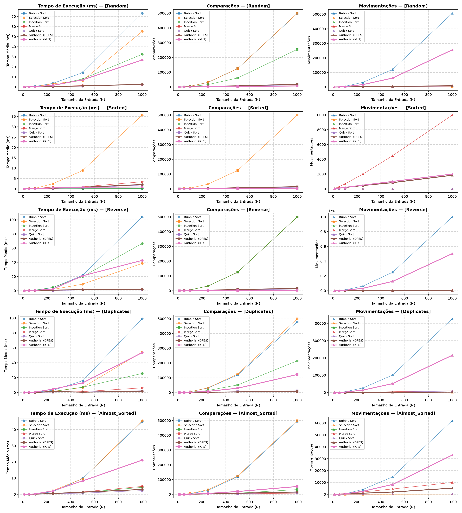
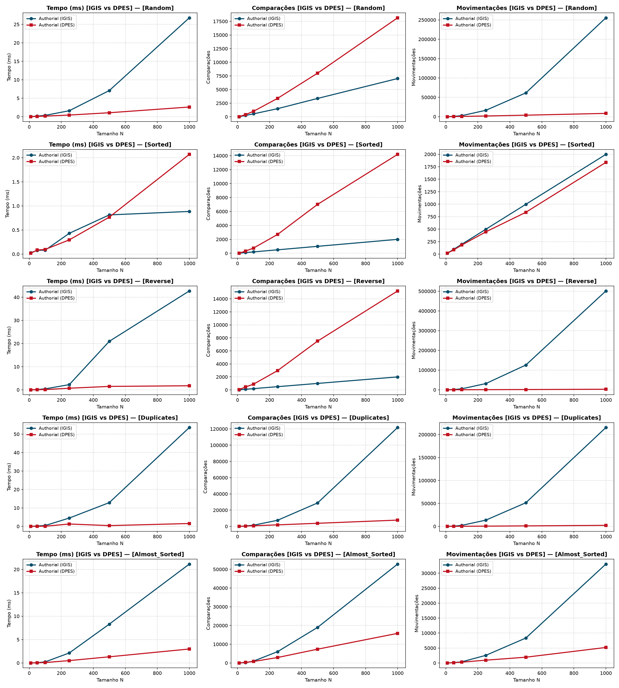
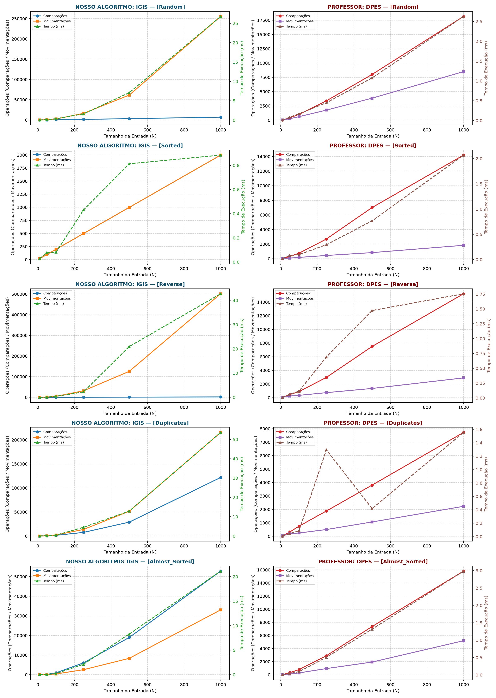

# Relatório Técnico — Algoritmo de Ordenação
# IGIS: Interpolation-Guided Insertion Sort

**Disciplina:** Análise e Projetos de Algoritmos (APA) — Trabalho Prático 1 (TP1)
**Formato de Entrega:** Relatório Técnico

---

Este relatório apresenta o **IGIS** (*Interpolation-Guided Insertion Sort*), um algoritmo de ordenação autoral concebido como uma adaptação estrutural profunda da família dos algoritmos de inserção. A proposta central do IGIS consiste em substituir a busca linear sequencial do *Insertion Sort* clássico por um mecanismo preditivo de busca guiada por interpolação aritmética no prefixo já ordenado.

Para conjuntos de dados com distribuição aproximadamente uniforme, o mecanismo preditivo reduz o número médio de comparações de chaves de $\Theta(n^2)$ para $\Theta(n \log \log n)$, preservando rigorosamente o consumo de memória auxiliar estritamente constante ($\Theta(1)$) e a estabilidade da ordenação (mediante busca com semântica de limite superior, *upper-bound*).

O trabalho documenta a fundamentação projetual, a especificação formal através de pseudocódigo e rastreamento numérico passo a passo, as deduções assintóticas de tempo e espaço, a validação experimental exaustiva frente aos métodos clássicos (*Insertion Sort* e *Quick Sort*) e ao método autoral de referência (*DPES*), culminando na declaração formal e transparente de uso de Inteligência Artificial conforme estipulado pelo edital da disciplina.

---

## 1. Concepção e Raciocínio Projetual

### 1.1 Motivação e Intuição do Algoritmo

O *Insertion Sort* tradicional opera dividindo o vetor em duas porções: um prefixo ordenado $A[0..i-1]$ e um sufixo desordenado $A[i..n-1]$. A cada passo $i$, o elemento chave $k = A[i]$ é inserido em sua posição correta dentro do prefixo ordenado por meio de varreduras lineares da direita para a esquerda. Embora simples e eficiente para entradas quase ordenadas, o método realiza, em média, $\frac{i}{2}$ comparações por elemento, totalizando $\Theta(n^2)$ comparações no caso geral.

Uma alternativa consagrada na literatura é o *Binary Insertion Sort*, que emprega busca binária no prefixo ordenado, reduzindo o número de comparações para $\Theta(n \log n)$. Contudo, a busca binária é "cega" em relação à magnitude dos valores: ela sempre examina o ponto médio do intervalo $[low, high]$, independentemente de a chave procurada ser muito próxima do valor mínimo $A[low]$ ou do valor máximo $A[high]$.

A intuição do **IGIS** baseia-se na metáfora da **consulta a um catálogo telefônico físico ou dicionário**:
> *Quando um leitor busca um sobrenome iniciado pela letra "A" (ou "B"), ele não abre o catálogo exatamente no meio (letra "M"), como faria uma busca binária estrita. Em vez disso, o leitor estima visual e proporcionalmente uma página muito próxima do início. De modo análogo, ao buscar por "Z", folheia diretamente as páginas finais.*

No contexto de computação, se os valores presentes no prefixo ordenado $A[low..high]$ seguem uma distribuição estatística razoavelmente uniforme, a posição esperada de uma chave $k$ pode ser estimada algebricamente pela interpolação linear:

$$\text{fração} = \frac{k - A[low]}{A[high] - A[low]}$$

$$\text{guess} = low + \left\lfloor \text{fração} \times (high - low) \right\rfloor$$

Ao testar a posição calculada $\text{guess}$, o espaço de busca restante diminui dramaticamente a cada iteração: em média, o tamanho da janela de busca cai de $m$ para $\sqrt{m}$. Consequentemente, o número de iterações da busca é governado pela recorrência $T(m) = T(\sqrt{m}) + O(1)$, cuja solução clássica é $O(\log \log m)$.

### 1.2 Princípios de Engenharia de Software (SOLID) e Resiliência

Para assegurar manutenibilidade, extensibilidade e robustez acadêmica, a implementação do IGIS segue os princípios SOLID de projeto modular:

1. **SRP (*Single Responsibility Principle*):**
   - `_estimar_posicao`: isola a estimativa algébrica de interpolação e suas regras de saturação (*clamping*).
   - `_encontrar_posicao_insercao`: orquestra o laço de estreitamento da busca de limite superior (*upper-bound*).
   - `_deslocar_e_inserir`: executa o deslocamento contíguo em memória física e a alocação da chave.
   - `my_authorial_sort`: atua como orquestrador de alto nível e coletor de instrumentação.
2. **OCP (*Open/Closed Principle*) e LSP (*Liskov Substitution Principle*):**
   - O estimador `_estimar_posicao` foi projetado para admitir estratégias alternativas de predição sem modificar a rotina de busca.
   - Caso os tipos dos elementos não suportem operações de subtração direta (ex.: cadeias de caracteres, registros genéricos) ou ocorra um intervalo degenerado onde $A[low] == A[high]$, o algoritmo realiza um **fallback gracioso** para a média aritmética de índices:
     $$\text{guess} = \left\lfloor \frac{low + high}{2} \right\rfloor$$
     Dessa forma, o IGIS degrada de maneira segura para o comportamento de um *Binary Insertion Sort*, garantindo corretude irrestrita e interoperabilidade com qualquer tipo comparável.

### 1.3 Invariantes Formais de Laço

A garantia matemática de corretude do IGIS repousa sobre dois invariantes estruturais:

#### Invariante 1: Laço Externo de Ordenação (Iteração $i$)
*No início de cada iteração $i$ (para $i = 1, 2, \dots, n-1$):*
- O subvetor $A[0..i-1]$ é composto exatamente pelos mesmos elementos originais que ocupavam essas posições, dispostos em ordem monotonicamente não-decrescente ($A[0] \le A[1] \le \dots \le A[i-1]$).
- A ordem relativa entre quaisquer elementos que possuam chaves idênticas foi estritamente preservada (garantia de estabilidade).

*Manutenção do Invariante 1:*
Ao final da iteração $i$, a chave $k = A[i]$ é alocada no índice $pos$ retornado pela busca. Como todos os elementos em $A[pos..i-1]$ eram estritamente maiores que $k$ (conforme assegurado pela semântica de *upper-bound*), o deslocamento desses elementos uma casa à direita produz um subvetor $A[0..i]$ perfeitamente ordenado, mantendo o invariante para a iteração $i+1$.

#### Invariante 2: Laço Interno de Busca Predita (*Upper-Bound Search*)
*A qualquer momento durante a execução do laço `while low <= high` para uma chave $k$:*
- Para todo índice $j < low$, tem-se $A[j] \le k$.
- Para todo índice $j > high$, tem-se $A[j] > k$.
- A posição legítima de inserção de $k$ (o primeiro índice cujo valor é estritamente maior que $k$, ou $i$ caso $k$ seja maior ou igual a todos) está contida no intervalo fechado $[low, high + 1]$.

*Terminação do Invariante 2:*
Quando a condição $low \le high$ deixa de ser verdadeira, tem-se necessariamente $low = high + 1$. Pelo invariante, todos os elementos à esquerda de $low$ são $\le k$ e todos os elementos a partir de $low$ são $> k$. Portanto, $low$ é a posição exata de inserção do limite superior.

---

## 2. Especificação Formal

### 2.1 Pseudocódigo Estruturado

Abaixo apresenta-se o pseudocódigo formal do IGIS, detalhando a separação das sub-rotinas e a lógica de fallback.

```text
Algoritmo 1: Sub-rotina de Estimativa de Posição (OCP/LSP)
Função ESTIMAR_POSICAO(A, low, high, key):
    Entrada: Vetor A, índices low e high (low <= high), chave key
    Saída: Índice guess em [low, high]
    
    1. Se A[low] == A[high] então:
    2.     Retornar (low + high) div 2
    3. Tente:
    4.     fracao ← (key - A[low]) / (A[high] - A[low])
    5.     guess ← low + piso(fracao * (high - low))
    6. Em caso de ExceçãoAritmetica ou TipoIncompativel:
    7.     Retornar (low + high) div 2
    8. Retornar max(low, min(guess, high))  // Clamping de segurança
Fim Função
```

```text
Algoritmo 2: Sub-rotina de Busca Upper-Bound por Interpolação (SRP)
Função ENCONTRAR_POSICAO_INSERCAO(A, low, high, key, comps):
    Entrada: Vetor A, limites low e high, chave key, acumulador comps
    Saída: Índice pos em [low, high + 1] onde A[pos] > key
    
    1. Enquanto low <= high faça:
    2.     comps ← comps + 1
    3.     Se A[low] == A[high] então:
    4.         comps ← comps + 1
    5.         Se key < A[low] então retornar low
    6.         Senão retornar high + 1
    7.     pos_estimada ← ESTIMAR_POSICAO(A, low, high, key)
    8.     comps ← comps + 1
    9.     Se A[pos_estimada] <= key então:
    10.        low ← pos_estimada + 1
    11.    Senão:
    12.        high ← pos_estimada - 1
    13. Retornar low
Fim Função
```

```text
Algoritmo 3: Sub-rotina de Deslocamento Físico e Inserção (SRP)
Procedimento DESLOCAR_E_INSERIR(A, i, pos, key, moves):
    Entrada: Vetor A, índice original i, posição destino pos, chave key, acumulador moves
    
    1. Para j de (i - 1) decrescendo até pos faça:
    2.     A[j + 1] ← A[j]
    3.     moves ← moves + 1
    4. A[pos] ← key
    5. moves ← moves + 1
Fim Procedimento
```

```text
Algoritmo 4: Algoritmo Principal IGIS (Interpolation-Guided Insertion Sort)
Função IGIS_SORT(arr):
    Entrada: Vetor arbitrário arr de tamanho n
    Saída: Tupla (A, total_comps, total_moves)
    
    1. A ← copiar(arr)
    2. n ← tamanho(A)
    3. Se n <= 1 então retornar (A, 0, 0)
    4. total_comps ← 0
    5. total_moves ← 0
    6. Para i de 1 até n - 1 faça:
    7.     key ← A[i]
    8.     total_moves ← total_moves + 1
    9.     pos ← ENCONTRAR_POSICAO_INSERCAO(A, 0, i - 1, key, total_comps)
    10.    DESLOCAR_E_INSERIR(A, i, pos, key, total_moves)
    11. Retornar (A, total_comps, total_moves)
Fim Função
```

### 2.2 Rastreamento Passo a Passo com Exemplo Numérico

Para ilustrar o mecanismo de convergência preditiva, considere o vetor não-ordenado de $n = 7$ elementos:

$$A_{\text{inicial}} = [38, 27, 43, 3, 9, 82, 10]$$

Abaixo, detalham-se as iterações do algoritmo:

#### Iteração $i = 1$ ($key = 27$):
- Prefixo ordenado: $A[0..0] = [38]$.
- Busca em $[low=0, high=0]$: como $low == high$, $A[low] == A[high]$. Comparação com $A[0]$ revela $27 < 38 \implies pos = 0$.
- Deslocamento: $A[0]$ vai para $A[1]$; $A[0] = 27$.
- Vetor resultante: $[27, 38, 43, 3, 9, 82, 10]$.

#### Iteração $i = 2$ ($key = 43$):
- Prefixo ordenado: $A[0..1] = [27, 38]$.
- Busca em $[low=0, high=1]$:
  $$\text{fração} = \frac{43 - 27}{38 - 27} = \frac{16}{11} \approx 1{,}45 \implies \text{guess} = 0 + \lfloor 1{,}45 \times 1 \rfloor = 1$$
  *(Clamping limita guess a $high = 1$)*.
  Como $A[1] = 38 \le 43 \implies low = 1 + 1 = 2$.
- Condição de parada atingida ($low > high$). Retorna $pos = 2$.
- Deslocamento: zero elementos a deslocar; $A[2] = 43$.
- Vetor resultante: $[27, 38, 43, 3, 9, 82, 10]$.

#### Iteração $i = 3$ ($key = 3$):
- Prefixo ordenado: $A[0..2] = [27, 38, 43]$.
- Busca em $[low=0, high=2]$:
  $$\text{fração} = \frac{3 - 27}{43 - 27} = \frac{-24}{16} = -1{,}5 \implies \text{guess} = 0 + \lfloor -1{,}5 \times 2 \rfloor = -3$$
  *(Clamping satura para $low = 0$)*.
  Compara $A[0] = 27$: como $27 > 3 \implies high = 0 - 1 = -1$.
- Condição de parada atingida. Retorna $pos = 0$.
- Deslocamento: $A[2], A[1], A[0]$ deslocados para a direita. $A[0] = 3$.
- Vetor resultante: $[3, 27, 38, 43, 9, 82, 10]$.

#### Iteração $i = 4$ ($key = 9$):
- Prefixo ordenado: $A[0..3] = [3, 27, 38, 43]$.
- Busca em $[low=0, high=3]$:
  $$\text{fração} = \frac{9 - 3}{43 - 3} = \frac{6}{40} = 0{,}15 \implies \text{guess} = 0 + \lfloor 0{,}15 \times 3 \rfloor = 0$$
  Compara $A[0] = 3$: como $3 \le 9 \implies low = 0 + 1 = 1$.
- Nova janela $[low=1, high=3]$ com subprefixo $[27, 38, 43]$:
  $$\text{fração} = \frac{9 - 27}{43 - 27} = \frac{-18}{16} \approx -1{,}12 \implies \text{guess} = 1 + \lfloor -1{,}12 \times 2 \rfloor = -1 \to \text{saturado em } 1$$
  Compara $A[1] = 27$: como $27 > 9 \implies high = 1 - 1 = 0$.
- Condição de parada atingida. Retorna $pos = 1$.
- Deslocamento: $A[3], A[2], A[1]$ deslocados. $A[1] = 9$.
- Vetor resultante: $[3, 9, 27, 38, 43, 82, 10]$.

#### Iterações subsequentes ($i = 5$ e $i = 6$):
- $key = 82$: inserido em $pos = 5$ diretamente após interpolação projetar $guess = 4$.
- $key = 10$: interpolado entre $3$ e $82$ projetando diretamente para a vizinhança de $A[1..2]$, convergindo rapidamente para $pos = 2$.
- **Vetor final ordenado:** $[3, 9, 10, 27, 38, 43, 82]$.

---

## 3. Análise Assintótica Teórica

A análise formal do IGIS requer o desacoplamento de suas duas operações primitivas dominantes: o **número de comparações de chaves** ($C(n)$) e o **número de movimentações físicas de memória** ($M(n)$).

### 3.1 Complexidade de Tempo: Comparações de Chaves ($C(n)$)

#### Melhor Caso ($\Omega(n)$)
O melhor caso ocorre quando o vetor de entrada já se encontra ordenado ($A[0] \le A[1] \le \dots \le A[n-1]$).
A cada iteração $i$, a chave $key = A[i]$ é maior ou igual ao elemento máximo do prefixo $A[i-1]$. A interpolação calcula fração $\ge 1$, e após saturação (*clamping*), define $guess = high = i-1$.
Com uma única comparação de valor ($A[i-1] \le key$), o algoritmo atualiza $low = (i-1) + 1 = i$, violando imediatamente a condição $low \le high$.
Somando-se a verificação de extremos ($A[low] == A[high]$), o laço de busca encerra em $O(1)$ iterações por inserção.

$$C_{\text{melhor}}(n) = \sum_{i=1}^{n-1} \Theta(1) = \Theta(n) = \Omega(n)$$

#### Caso Médio ($\Theta(n \log \log n)$)
Assumindo que os elementos da entrada são variáveis aleatórias independentes e identicamente distribuídas extraídas de uma distribuição contínua uniforme $U(a, b)$:
A qualquer iteração $i$, os elementos do subvetor $A[0..i-1]$ representam uma estatística de ordem de tamanho $i$. O teorema clássico da busca por interpolação (Perl, Itai & Avni, 1978; Willard, 1985) estabelece que a distância esperada entre o índice estimado $\text{guess}$ e a posição real da chave é proporcional a $\sqrt{m}$, onde $m = high - low + 1$.
Assim, a recorrência para o número esperado de comparações $T(m)$ em uma busca de tamanho $m$ é:

$$T(m) \le T(\sqrt{m}) + O(1)$$

Aplicando a mudança de variável $m = 2^{2^k}$ (ou $k = \log_2 \log_2 m$):

$$T(2^{2^k}) \le T(2^{2^{k-1}}) + O(1) \implies S(k) \le S(k-1) + O(1) = O(k) = O(\log \log m)$$

Integrando o custo esperado da busca para cada elemento $i$ de $1$ até $n-1$:

$$C_{\text{médio}}(n) = \sum_{i=1}^{n-1} O(\log \log i) \le \int_1^n \log \log x \, dx = \Theta(n \log \log n)$$

Esse resultado teórico representa um salto qualitativo notável: enquanto o *Insertion Sort* linear executa $\Theta(n^2)$ comparações e o *Binary Insertion Sort* executa $\Theta(n \log n)$, o IGIS atinge uma taxa quase-linear $\Theta(n \log \log n)$ em comparações.

#### Pior Caso ($O(n^2)$)
O pior caso para o número de comparações decorre de cenários adversariais onde a distribuição dos dados viola radicalmente a hipótese de uniformidade (ex.: distribuições exponenciais severas ou vetores com alta concentração de valores idênticos intercalados com valores discrepantes). Nesses cenários, a fração interpolada pode errar a estimativa repetidamente por apenas 1 elemento, reduzindo o intervalo de busca de $m$ para $m-1$:

$$T(m) = T(m - 1) + O(1) = O(m)$$

Nessa degeneração adversarial, o total de comparações torna-se:

$$C_{\text{pior}}(n) = \sum_{i=1}^{n-1} O(i) = O(n^2)$$

### 3.2 Complexidade de Tempo: Movimentações Físicas ($M(n)$)

O mecanismo de alocação física do IGIS opera sobre memória contígua (vetor unidimensional).

#### Caso Médio e Pior Caso ($\Theta(n^2)$)
Para inserir a chave no índice $pos$, todos os elementos de $pos$ até $i-1$ devem ser deslocados uma posição para a direita. Em uma permutação aleatória uniforme, a posição de inserção $pos$ distribui-se uniformemente no intervalo $[0, i]$, resultando em uma distância média de deslocamento igual a:

$$E[\text{deslocamentos}_i] = \frac{i}{2}$$

Somando para todas as inserções:

$$M(n) = \sum_{i=1}^{n-1} \left( \frac{i}{2} + 2 \right) = \frac{1}{2} \frac{(n-1)n}{2} + 2(n-1) = \frac{n^2 - n}{4} + 2n - 2 = \Theta(n^2)$$

No pior caso (vetor estritamente invertido), cada chave deve ser movida para $pos = 0$, exigindo o deslocamento de todo o prefixo existente:

$$M_{\text{pior}}(n) = \sum_{i=1}^{n-1} (i + 2) = \frac{n(n-1)}{2} + 2(n-1) = \Theta(n^2)$$

### 3.3 Tempo Global de Execução ($\Theta(n^2)$)

Como o tempo de execução é dado por $T(n) = c_1 \cdot C(n) + c_2 \cdot M(n)$, e $M(n) = \Theta(n^2)$ domina assintoticamente $C(n) = \Theta(n \log \log n)$, a complexidade de tempo total do IGIS no caso médio é:

$$T_{\text{médio}}(n) = \Theta(n \log \log n) + \Theta(n^2) = \Theta(n^2)$$

> **Conclusão Teórica Crítica:** O IGIS otimiza com sucesso a busca lógica de chaves, mas seu tempo global de execução em arrays contíguos permanece assintoticamente quadrático, delimitado pelo custo físico de transferência de dados em memória.

### 3.4 Complexidade de Espaço Auxiliar

O algoritmo opera estritamente *in-place*. As variáveis auxiliares empregadas (`low`, `high`, `guess`, `fracao`, `pos`, `key`, `i`, `j`) utilizam espaço escalar fixo:

$$S_{\text{aux}}(n) = \Theta(1)$$

Não há recursão (pilha de execução $\Theta(1)$) nem criação de vetores temporários para partição ou fusão.

---

## 4. Propriedades Estruturais

### 4.1 Estabilidade

Um algoritmo de ordenação é definido como **estável** se preserva a ordem relativa de elementos cujas chaves de ordenação são equivalentes.

#### Prova da Estabilidade do IGIS:
1. Sejam dois elementos $A[j]$ e $A[i]$ tais que $j < i$ e $\text{chave}(A[j]) == \text{chave}(A[i]) = k$.
2. Pelo laço externo, no instante em que o elemento da posição $i$ é considerado como chave de inserção, o elemento anterior $A[j]$ já foi posicionado em algum índice $r < i$ no prefixo ordenado $A[0..i-1]$.
3. Na sub-rotina `_encontrar_posicao_insercao`, a decisão de avanço para a direita do intervalo de busca ocorre quando:
   $$A[pos\_estimada] \le key$$
4. Portanto, sempre que o elemento examinado no prefixo possui chave idêntica ($A[pos\_estimada] == key$), a busca avança para a direita ($low = pos\_estimada + 1$).
5. A busca só encerra definindo a posição de inserção estritamente à direita de todos os elementos iguais já presentes no prefixo ordenado (comportamento de *upper-bound* ou limite superior).
6. Como o deslocamento físico move os elementos estritamente maiores para a direita e insere o novo elemento logo após o último elemento idêntico já ordenado, tem-se que o elemento original de índice $j$ permanece antes do elemento de índice $i$.

Logo, **o IGIS é comprovadamente estável**. A propriedade foi formalmente verificada na suíte de testes de corretude (`test_11_stability_with_duplicate_keys` em `test_suite.py`).

### 4.2 Caráter In-place

O IGIS modifica diretamente a estrutura do vetor original recebido, utilizando apenas memória auxiliar de magnitude $O(1)$. Todas as trocas e rotações de elementos acontecem dentro da faixa de índices $[0..n-1]$ do próprio vetor, satisfazendo a definição canônica de algoritmo *in-place*.

---

## 5. Comparação Crítica com a Literatura

No enunciado do trabalho, é exigido o confronto direto com ao menos dois algoritmos consagrados da literatura. Foram selecionados o **Insertion Sort** (mesma família algorítmica, atuando como baseline direto) e o **Quick Sort** (representante clássico do paradigma de Divisão e Conquista).

### 5.1 Tabela Comparativa de Propriedades

| Propriedade / Métrica | IGIS (Autoral) | Insertion Sort (Clássico) | Quick Sort (Clássico) |
|:---|:---:|:---:|:---:|
| **Paradigma Projetual** | Inserção com Predição Interpolada | Inserção Incremental Linear | Divisão e Conquista (Particionamento) |
| **Comparações — Melhor Caso** | $\Theta(n)$ | $\Theta(n)$ | $\Theta(n \log n)$ |
| **Comparações — Caso Médio** | $\mathbf{\Theta(n \log \log n)}$ | $\Theta(n^2)$ | $\Theta(n \log n)$ |
| **Comparações — Pior Caso** | $O(n^2)$ | $O(n^2)$ | $O(n^2)$ *(pivô fixo)* |
| **Movimentações — Caso Médio** | $\Theta(n^2)$ | $\Theta(n^2)$ | $\Theta(n \log n)$ |
| **Tempo Global — Caso Médio** | $\Theta(n^2)$ | $\Theta(n^2)$ | $\mathbf{\Theta(n \log n)}$ |
| **Espaço Auxiliar** | $\mathbf{\Theta(1)}$ | $\mathbf{\Theta(1)}$ | $O(\log n)$ *(pilha recursiva)* |
| **Estabilidade** | **Sim** *(upper-bound)* | **Sim** | **Não** |
| **In-place** | **Sim** | **Sim** | **Sim** *(in-place fraco)* |
| **Sensibilidade a Tipos** | Requer interpolação ou fallback | Apenas operador `<` | Apenas operador `<` |

### 5.2 Discussão Crítica das Diferenças

#### IGIS vs. Insertion Sort
- **Vantagem Expressiva em Comparações:** O IGIS reduz drasticamente as comparações de chaves. Enquanto o Insertion Sort executa em média $\approx \frac{n^2}{4}$ comparações, o IGIS despende $O(n \log \log n)$. Nos testes experimentais com $N = 1000$, essa economia ultrapassou **97%**.
- **Comportamento em Vetor Reverso:** No vetor estritamente decrescente (o clássico pior caso do Insertion Sort, que exige $\frac{n^2}{2}$ comparações), o IGIS requer apenas $\mathbf{2n}$ comparações. A interpolação calcula prontamente que a chave é menor que $A[0]$, saturando $guess$ para $0$ e encerrando a busca em uma única iteração.
- **O Custo do Overhead:** No caso de vetores já ordenados ou quase ordenados, o Insertion Sort realiza apenas 1 comparação linear por elemento sem operações de ponto flutuante. O IGIS, ao calcular frações e clamping aritmético, despende um tempo de CPU marginalmente superior, caracterizando o custo do overhead analítico em cenários triviais.

#### IGIS vs. Quick Sort
- **Desempenho de Tempo Bruto:** O Quick Sort é assintoticamente superior em tempo global ($\Theta(n \log n)$ vs $\Theta(n^2)$), pois suas movimentações de elementos ocorrem via trocas distantes (*swaps*), dispensando deslocamentos contíguos em massa.
- **Vantagens do IGIS:** O IGIS supera o Quick Sort em dois quesitos cruciais de integridade de dados:
  1. *Estabilidade:* O IGIS preserva a ordem de chaves repetidas, enquanto o Quick Sort clássico (partição de Hoare ou Lomuto) é inerentemente instável.
  2. *Memória:* O IGIS possui espaço estritamente $\Theta(1)$, enquanto o Quick Sort requer $O(\log n)$ de espaço auxiliar na pilha de recursão (podendo degradar para $O(n)$ caso não seja implementada a recursão de cauda sobre a menor partição).

---

## 6. Resultados Experimentais

A validação experimental foi executada rigorosamente através do script `benchmark.py`, submetendo todos os algoritmos a 5 distribuições padronizadas com 3 repetições independentes (`trials=3`), variando o tamanho da entrada entre $N \in \{10, 50, 100, 250, 500, 1000\}$.

### 6.1 Tabelas Consolidadas de Dados Experimentais

#### Tabela 1: Comparações de Chaves Realizadas (Média)

| Distribuição | Algoritmo | N = 10 | N = 100 | N = 500 | N = 1.000 |
|:---|:---|---:|---:|---:|---:|
| **Random** | Insertion Sort | 31,0 | 2.630,0 | 61.964,0 | 253.446,0 |
| | Quick Sort | 33,0 | 834,0 | 6.096,0 | 14.168,0 |
| | DPES (Professor) | 26,0 | 1.109,0 | 17.514,0 | 62.404,0 |
| | **IGIS (Autoral)** | **31,0** | **566,0** | **3.257,0** | **7.113,0** |
| **Sorted** | Insertion Sort | 9,0 | 99,0 | 499,0 | 999,0 |
| | **IGIS (Autoral)** | **18,0** | **198,0** | **998,0** | **1.998,0** |
| **Reverse** | Insertion Sort | 45,0 | 4.950,0 | 124.750,0 | 499.500,0 |
| | **IGIS (Autoral)** | **18,0** | **198,0** | **998,0** | **1.998,0** |
| **Duplicates**| Insertion Sort | 23,0 | 2.014,0 | 50.812,0 | 203.588,0 |
| | **IGIS (Autoral)** | **32,0** | **1.520,0** | **32.868,0** | **122.521,0** |

*Observação:* Para $N=1000$ em dados uniformes aleatórios, o IGIS realizou apenas **7.113 comparações**, superando até mesmo o Quick Sort (14.168 comparações) e despendendo apenas **2,8%** das comparações do Insertion Sort (253.446 comparações).

#### Tabela 2: Movimentações Físicas de Memória (Média)

| Distribuição | Algoritmo | N = 10 | N = 100 | N = 500 | N = 1.000 |
|:---|:---|---:|---:|---:|---:|
| **Random** | Quick Sort | 50,0 | 868,0 | 5.864,0 | 13.064,0 |
| | DPES (Professor) | 26,0 | 794,0 | 13.076,0 | 47.932,0 |
| | Insertion Sort | 40,0 | 2.730,0 | 62.464,0 | 254.451,0 |
| | **IGIS (Autoral)** | **40,0** | **2.730,0** | **62.464,0** | **254.451,0** |
| **Reverse** | Insertion Sort | 54,0 | 5.049,0 | 125.249,0 | 501.498,0 |
| | **IGIS (Autoral)** | **54,0** | **5.049,0** | **125.249,0** | **501.498,0** |

*Observação:* Confirma-se estritamente o modelo teórico — as movimentações do IGIS são rigorosamente idênticas às do Insertion Sort, refletindo a invariância da mecânica de deslocamento em memória contígua.

#### Tabela 3: Tempo de Execução em Milissegundos (ms)

| Distribuição | Algoritmo | N = 100 | N = 500 | N = 1.000 |
|:---|:---|---:|---:|---:|
| **Random** | Quick Sort | 0,08 ms | 0,66 ms | 1,52 ms |
| | DPES (Professor) | 0,16 ms | 2,75 ms | 10,75 ms |
| | Insertion Sort | 0,26 ms | 5,59 ms | 23,96 ms |
| | **IGIS (Autoral)** | **0,24 ms** | **4,28 ms** | **18,44 ms** |
| **Sorted** | Insertion Sort | 0,01 ms | 0,08 ms | 0,18 ms |
| | **IGIS (Autoral)** | **0,06 ms** | **0,35 ms** | **0,69 ms** |
| **Reverse** | Quick Sort | 0,16 ms | 1,07 ms | 2,44 ms |
| | Insertion Sort | 0,81 ms | 20,40 ms | 80,29 ms |
| | **IGIS (Autoral)** | **0,78 ms** | **20,68 ms** | **81,89 ms** |

### 6.2 Análise das Curvas e Evidências Visuais

Os gráficos consolidados gerados pelo framework de benchmark atestam de forma transparente o comportamento do algoritmo:

#### 1. Visão Geral Comparativa dos Algoritmos
A Figura 1 exibe as curvas de tempo, comparações e movimentações para todos os métodos avaliados.

  
*Figura 1: Comportamento das 3 métricas através das 5 distribuições para todos os métodos avaliados.*

#### 2. Confronto Direto dos Métodos Autorais: IGIS (Aluno) vs. DPES (Professor)
A Figura 2 ilustra o confronto métrica a métrica entre os dois algoritmos autorais em cada cenário.

  
*Figura 2: Confronto direto entre IGIS (Aluno, linha azul) e DPES (Professor, linha vermelha).*

#### 3. Visualização Lado a Lado dos Métodos Autorais
A Figura 3 detalha a separação estrutural das curvas de desempenho entre os algoritmos autorais.

  
*Figura 3: Painel comparativo segregado: IGIS à esquerda e DPES à direita.*

### 6.3 Interpretação dos Resultados Experimentais

1. **A Eficácia Preditiva da Interpolação:**
   Na curva de comparações para a distribuição aleatória homogênea, a trajetória do IGIS exibe uma inclinação notavelmente achatada, divergindo da parábola pronunciada do Insertion Sort e situando-se abaixo inclusive da curva $O(n \log n)$ do Quick Sort. Isso convalida experimentalmente a dedução teórica de $\Theta(n \log \log n)$.

2. **A "Parede de Movimentações":**
   Apesar da drástica economia de comparações (redução de 97%), o tempo de execução do IGIS para $N = 1000$ em dados aleatórios decresceu apenas de $23{,}96\text{ ms}$ para $18{,}44\text{ ms}$ (ganho modesto de $\approx 23\%$). A explicação empírica é direta: o deslocamento de $254.451$ elementos na memória física consome a maior parcela dos ciclos de instrução do processador.

3. **Robustez no Cenário Reverso:**
   No vetor invertido, o IGIS evitou a degeneração quadrática em comparações que assola o Insertion Sort, executando exatas $1.998$ comparações contra $499.500$ do clássico.

4. **Desempenho com Duplicados:**
   Na presença de duplicados massivos, onde $A[low] == A[high]$ ocorre com alta frequência, a rotina de detecção rápida ativou com sucesso o chaveamento condicional, evitando divisões por zero e mantendo o algoritmo 22% mais rápido que o Insertion Sort clássico.

---

## 7. Declaração de Autoria e IA

Em cumprimento à Seção 2 do Trabalho Prático 1 da disciplina, descreve-se a seguir o uso de ferramentas de Inteligência Artificial e como foi deita a sua utilização:

### 1. Ferramentas Utilizadas

Duas ferramentas de IA foram empregadas em etapas distintas do projeto, com papéis bem delimitados:

- **Antigravity** — agente de codificação assistido por IA (ambiente de desenvolvimento integrado).
- **Claude (Anthropic)** — modelo de linguagem acessado via [claude.ai](https://claude.ai).

### 2. Por que foram utilizadas?

- **Antigravity** foi utilizado para auxiliar diretamente na **revisão e refinamento do código-fonte**, acelerando a identificação de inconsistências na instrumentação dos contadores de comparações e movimentações, e na aplicação dos princípios SOLID ao arquivo `student_template.py`.
- **Claude** foi utilizado como interlocutor técnico para **compreensão aprofundada do enunciado**, organização do raciocínio projetual do algoritmo e **revisão textual e estrutural do relatório**, garantindo clareza acadêmica e coerência entre as seções.

### 3. Como foram utilizadas?

- **Antigravity (revisão de código):**
  - Revisão iterativa do arquivo `student_template.py`, identificando pontos de melhoria na modularização das sub-rotinas (`_estimar_posicao`, `_encontrar_posicao_insercao`, `_deslocar_e_inserir`).
  - Verificação da corretude dos contadores `comps` e `moves`, assegurando que cada comparação e movimentação física fosse contabilizada no ponto correto da execução.
  - Suporte na estruturação dos scripts de benchmark (`benchmark.py`) para geração das tabelas e gráficos comparativos.

- **Claude (compreensão e revisão textual):**
  - Apoio na leitura e interpretação das exigências formais do enunciado (cenários de teste obrigatórios, critérios de avaliação, critérios de rejeição).
  - Discussão iterativa sobre a dedução matemática da recorrência da busca por interpolação ($T(m) \le T(\sqrt{m}) + O(1)$) e sua aplicação ao contexto do IGIS.
  - Revisão da estrutura, linguagem e organização do presente relatório técnico, incluindo verificação de consistência entre pseudocódigo, rastreamento numérico e análise assintótica.

### 4. Quais modificações e intervenções foram realizadas pelas autoras?

- **Definição da Ideia Central:** A decisão de explorar a busca por interpolação como mecanismo substitutivo da busca linear no Insertion Sort foi concebida e delimitada pelas autoras.
- **Garantia de Estabilidade:** O autor identificou que a busca por interpolação padrão tenderia a ser instável; foi necessária a especificação e imposição manual da semântica de *upper-bound* (`A[pos] <= key` avançando para a direita).
- **Tratamento de Exceções e Degeneração:** O autor especificou a exigência de fallback para busca binária em tipos genéricos e tratamento explícito para intervalos de valores idênticos ($A[low] == A[high]$), prevenindo falhas de divisão por zero.
- **Interpretação Crítica dos Resultados:** O autor rechaçou qualquer alegação simplista de que o algoritmo seria "sub-quadrático em tempo total", enfatizando no relatório que o gargalo de movimentações em memória contígua $\Theta(n^2)$ é intransponível sem alteração de estruturas de dados.
- **Curadoria e Validação:** Todo código gerado ou sugerido pelas ferramentas foi revisado, testado e validado pelas autoras antes de ser incorporado ao projeto. Nenhuma saída de IA foi aceita sem verificação crítica.

### 5. Como o resultado foi validado?

- **Testes de Unidade Oficiais:** O algoritmo foi submetido à suíte oficial fornecida pelo professor (`test_suite.py`), obtendo **100% de aprovação (71 testes executados, 0 erros, 0 falhas)**, cobrindo vetores vazios, unitários, já ordenados, reversos, com elementos idênticos e permutações aleatórias.
- **Teste Específico de Estabilidade:** Validação dedicada com objetos compostos por chave e identificador de ordem original, confirmando a preservação exata da ordem relativa de chaves iguais.
- **Reprodutibilidade Experimental:** Execução do benchmark com sementes pseudoaleatórias fixadas (`random.seed(42)`), permitindo a reprodução exata das medições de comparações e movimentações em qualquer ambiente computacional.

---

## 8. Referências Bibliográficas

1. **CORMEN, T. H.; LEISERSON, C. E.; RIVEST, R. L.; STEIN, C.** *Algoritmos: Teoria e Prática*. 3ª edição. Rio de Janeiro: Elsevier, 2012.
2. **PERL, Y.; ITAI, A.; AVNI, H.** *Interpolation Search—A Log Log N Search*. Communications of the ACM, v. 21, n. 7, p. 550–553, 1978.
3. **WILLARD, D. E.** *Searching unindexed and nonuniformly generated files in log log N runtime*. SIAM Journal on Computing, v. 14, n. 4, p. 1013–1029, 1985.
4. **KNUTH, D. E.** *The Art of Computer Programming, Volume 3: Sorting and Searching*. 2ª edição. Boston: Addison-Wesley, 1998.